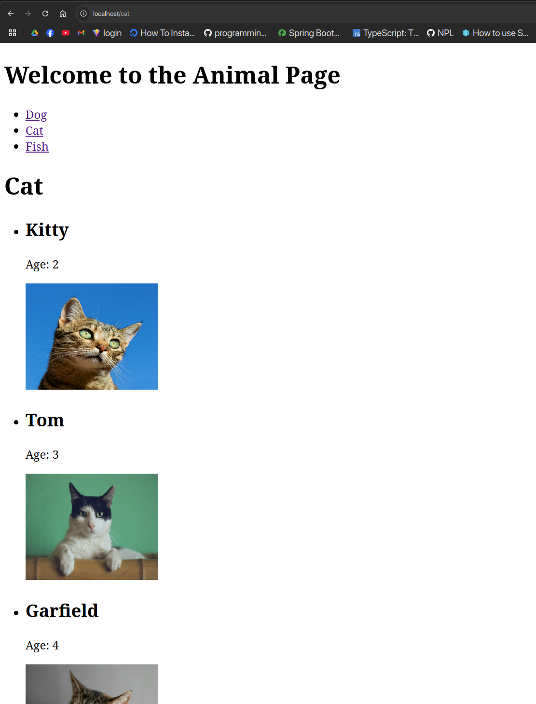

# front end deploy

1. build this project
```sh
yarn build
```

2. Di chuyển kết quả của build (nội dung thư mục dist) đến /var/www/html

3. cấu hình trong site-enable/file_cau_hinh

```conf
 root /var/www/html;
    index index.html;
    location / {
	    try_files $uri $uri/ =404;
    }
```

4. vào xem kết quả ở localhost

**(Nhớ chạy các service và cấu hình nginx cho từng cái nhe trời.) 
Giờ chỉ cần dùng localhost thôi.**

